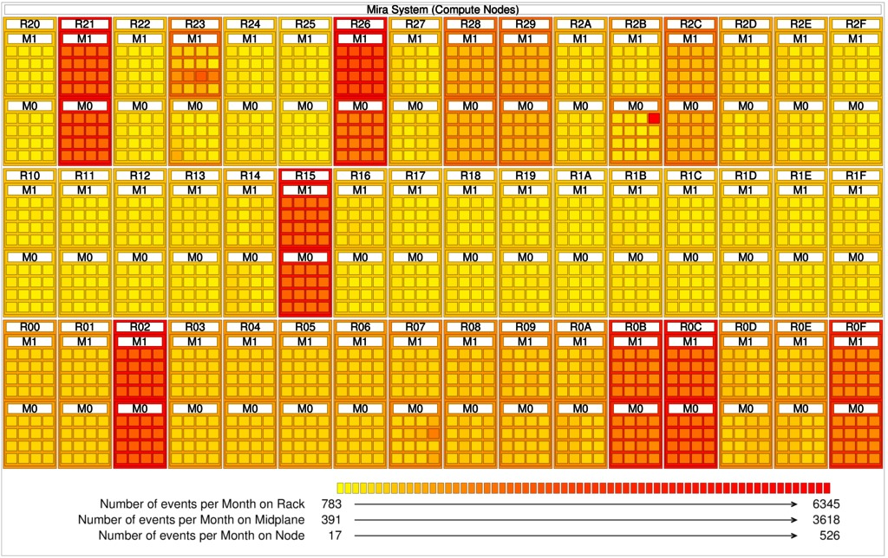

LogAider
========

- [Description](#1)
- [Dependencies](#2)
- [How to use LogAider](#3)
	- [*1. Parsing and Filtering*](#3.1)
		- [Analysis based on RAS log](#3.1.1)
			- [Extract all warn and fatal messages from original log](#3.1.1.1)
			- [Classify Log Based on MessageID](#3.1.1.2)
		- [Analysis based on job scheduling log (Cobalt)](#3.1.2)
			- [Extract all error messages (with non-exit code)](#3.1.2.1)
	- [*2. Across-Field correlation*](#3.2)
		- [Analysis based on RAS Log](#3.2.1)
			- [Extract value types for each field](#3.2.1.1)
			- [Gererate state features](#3.2.1.2)
			- [Construct value-combination pool based on schema and featureStates](#3.2.1.3)
			- [Calculate the number of value combinations by brute-force method](#3.2.1.4)
			- [Calculate the number of value combinations by brute-force method](#3.2.1.5)
			- [Generate analysis for inputMsg.txt](#3.2.1.6)
			- [Generate spatial distribution (to be plotted in a graph by plot.PlotMiraGraph later on)](#3.2.1.7)
		- [Analysis based on job scheduling log (Cobalt)](#3.2.2)
			- [Extract value types for each field](#3.2.2.1)
			- [Generate state features](#3.2.2.2)
			- [Generate state features](#3.2.2.3)
	- [*3. Plot error distribution*](#3.3)
	- [*4. Generate monthly and daily Log Analysis Results*](#3.4)
		- [use 'separate' mode to get monthly results](#3.4.1)
		- [Generate monthly data results for category and component](#3.4.2)
		- [Compute Daily Count](#3.4.3)
	- [*5. Analyze the error propagation (similarity-based filter)*](#3.5)
		- [Analyze the error propagation (with the same type)](#3.5.1)
	- [*6. Analyze Spatial-correlation*](#3.6)
		- [ChiSquared Sygnificance Test](#3.6.1)
		- [K means clustering analysis](#3.6.2)
			- [Generate K-means Clustering results](#3.6.2.1)
			- [Plot the K means clustering results](#3.6.2.2)
			

<a id="1"/>Description</a>
-----------

Today’s large-scale supercomputers are producing
a huge amount of log data. Exploring various potential correla-
tions of fatal events is crucial for understanding their causality
and improving the working efficiency for system administra-
tors. To this end, we developed a toolkit, named LogAider,
that can reveal three types of potential correlations: across-
field, spatial, and temporal. Across-field correlation refers to
the statistical correlation across fields within a log or across
multiple logs based on probabilistic analysis. For analyzing
the spatial correlation of events, we developed a generic, easy-
to-use visualizer that can view any events queried by users
on a system machine graph. LogAider can also mine spatial
correlations by an optimized K-meaning clustering algorithm
over a Torus network topology. It is also able to disclose the
temporal correlations (or error propagations) over a certain
period inside a log or across multiple logs, based on an effective
similarity analysis strategy. 

This code corresponds to the paper published in CCGrid2017: [LogAider - A tool for mining potential correlations in HPC system logs](https://ieeexplore.ieee.org/document/7973730/).

As the developer, I strongly recommend you to read the paper carefully to understand how LogAider works, in that the following description may use some terms defined in the paper, such as value-combination pool.

The Mira RAS log data are available to download from [https://reports.alcf.anl.gov/data/mira.html](https://reports.alcf.anl.gov/data/mira.html)

The above log data page includes all severity levels of messages (including INFO, WARN and FATAL). If you are interested in only fatal events, we already extracted them to be [here](fatalevents/totalFatalMsg.fat.tar.gz).
You can also extract the fatal events by yourself using analysis.RAS.CollectWarnFatalMessags (requiring a huge memory setting though), which will be described later.

<a id="2"/>Dependencies</a>
-----------

LogAider is coded in Java, so you need to install JDK 1.8+
(checking the version of JDK on your machine using 'java --version')

After installing JDK, you are ready to use LogAider by running the corresponding bash scripts or the java programs.

(Optional: If you want to plot spatial locations, you need to have Gnuplot installed on your machine)

<a id="3"/>How to use LogAider</a>
-----------

LogAider provides a rich set of analysis functions as listed below, for mining the correlations of events in a Reliability, Availability and Serviablity (RAS) log.
In the following, we use the RAS log of MIRA supercomputer (BlueG/Q system) as an example. We provide flexible schema files for users to edit, in order to adapt to other systems. 

### <a id="3.1"/>1. Parsing and Filtering</a>

This part discusses how to parse and filter the data

#### <a id="3.1.1"/>Analysis based on RAS log</a>

- **Extract all warn and fatal messages from original log**
	- *Script*: CollectWarnFatalMessages.sh  
	- *Source Code*: analysis.RAS.CollectWarnFatalMessages.java  
	- *Usage*: java analysis.RAS.CollectWarnFatalMessags [schemaPath] [severity_index] [file or directory: -f/-d] [logDir/logFile] [log_extension]  
	- *Example*: Example: java -Xmx50000m CollectWarnFatalMessags /home/sdi/Catalog-project/miralog/schema/basicSchema.txt 4 -d /home/sdi/Catalog-project/miralog csv  

> *schema file* is used to specify the format of the log data. For example, in MIRA RAS log, the basicScheme.txt looks like this:  

```
#Column 		name    schema  	Data type name  Length
RECI			DSYSIBM INTEGER 	4       0       No
MSG_ID			SYSIBM  CHARACTER       8       0       Yes  
CATEGORY		SYSIBM  CHARACTER       16      0       Yes  
COMPONENT		SYSIBM  CHARACTER       16      0       Yes  
SEVERITY		SYSIBM  CHARACTER       8       0       Yes  
EVENT_TIME		SYSIBM  TIMESTAMP       10      6       No  
JOBID			SYSIBM  BIGINT  	8       0       Yes  
BLOCK			SYSIBM  CHARACTER       32      0       Yes  
LOCATION		SYSIBM  CHARACTER       64      0       Yes  
SERIALNUMBER		SYSIBM  CHARACTER       19      0       Yes  
CPU			SYSIBM  INTEGER 	4       0       Yes  
COUNT			SYSIBM  INTEGER 	4       0       Yes  
CTLACTION		SYSIBM  VARCHAR 	256     0       Yes
MESSAGE			SYSIBM  VARCHAR 	1024    0       Yes
DIAGS			SYSIBM  CHARACTER       1       0       No
QUALIFIER		SYSIBM  CHARACTER       32      0       Yes
```

> In the above example, /home/sdi/Catalog-project/miralog is the directory containing the original RAS log data files, whose extensions are csv.  
Some examples are showns below:  
```
[sdi@sdihost RasLog]$ ls
ANL-ALCF-RE-MIRA_20130409_20131231.csv  ANL-ALCF-RE-MIRA_20140101_20141231.csv  ANL-ALCF-RE-MIRA_20150101_20151231.csv  ANL-ALCF-RE-MIRA_20160101_20161231.csv  ANL-ALCF-RE-MIRA_20170101_20170831.csv  
[sdi@sdihost RasLog]$ cat ANL-ALCF-RE-MIRA_20130409_20131231.csv  
"RECID","MSG_ID","CATEGORY","COMPONENT","SEVERITY","EVENT_TIME","JOBID","BLOCK","LOCATION","SERIALNUMBER","CPU","COUNT","CTLACTION","MESSAGE","DIAGS","QUALIFIER","MACHINE_NAME"
13113415,"0008003C","Software_Error","FIRMWARE","INFO","2013-04-01 00:00:37.072514",180219,"MIR-40000-737F1-4096","R0D-M0-N05-J06","74Y9656YL1CK135701C",65,"","","DDR0 PHY was recalibrated(0):  taken = 196 usec. Previous cal was 209.5 seconds ago.","F","655148938                       ","mira"
13113416,"00080034","DDR","FIRMWARE","INFO","2013-04-01 00:00:42.804000",180268,"MIR-44400-77771-1024","R1C-M0-N12-J14","00E5870YL1FB227033C",8,8713,"","DDR  Correctable Error Summary : count=8713 MCFIR error status:  [POWERBUS_WRITE_BUFFER_CE] This bit is set when a PBUS ECC CE is detected on a PBus write buffer read op;","F","50419698                        ","mira"
13113417,"0008002F","BQC","FIRMWARE","INFO","2013-04-01 00:00:42.806127",180268,"MIR-44400-77771-1024","R1C-M0-N12-J14","00E5870YL1FB227033C",8,27355,"","L1P Correctable Error Summary : count=27355 cores=0,1,2,3,4,5,6,7,8,9,10,11,12,13,14,15 L1P_ESR : [ERR_RELOAD_ECC_X2] correctable reload data ECC error;","F","50419698                        ","mira"
13113418,"00080030","BQC","FIRMWARE","INFO","2013-04-01 00:00:42.807463",180268,"MIR-44400-77771-1024","R1C-M0-N12-J14","00E5870YL1FB227033C",8,400,"","L2 Array Correctable Error Summary : count=400 slices=10 L2_INTERRUPT_STATE error status:  [EDR_CE] Coherence array correctable error;","F","50419698                        ","mira"
13113419,"0006100E","Optical_Module","MMCS","WARN","2013-04-01 00:00:51.477275","","","R21-M0-N09-O13","","","","","Health Check detected an abnormal condition for the optical module at location R21-M0-N09-O13.  The condition is related to POWER 11 .","F","","mira"
.....
```

> *hint* :   
> * *-Xmx50000m* means applying for 50GB for JVM to run this test. The size of memory required depends on the data items you need to process.  
> * If you encounter the error 'java.lang.OutOfMemoryError: Java heap space', this means you need to increase the memory size by using -Xmx.  
> * All the java classes need to be run using java <the full path of program> <arguments...>: e.g., java analysis.RAS.CollectWarnFatalMessags .... instead of java CollectWarnFatalMessags ....

- **Classify Log Based on MessageID**
	- *Script*: -  
	- *Source Code*: filter.ClassifyLogBasedonMessageID.java  
	- *Usage*: java filter.ClassifyLogBasedonMessageID [inputLogFile] [outputDir]  
	- *Example*: java ClassifyLogBasedonMessageID /home/sdi/Catalog-project/miralog/totalFatalMsg.fat /home/sdi/Catalog-project/miralog/FilterAndClassify

> *inputLogFile* refers to the file containing all the fatal messages (assuming you are focused on only fatal messages in the study).  
*outputDir* refers to the directory that will contain the output results. 

> The output will look as follows: 
```
[sdi@sdihost FilterAndClasify]$ ls
00010001.fltr  00040028.ori   0004009A.ori   000400E7.ori   00040122.ori   00040144.ori   00062005.ori   0008000B.ori   00080029.ori   00090101.ori   00090213.ori   000B0005.ori
00010001.ori   00040037.fltr  000400A0.fltr  000400ED.fltr  00040124.fltr  00040148.fltr  00070214.fltr  0008000C.fltr  0008003A.fltr  00090102.fltr  00090216.fltr  allEvents-2015.txt
00010007.fltr  00040037.ori   000400A0.ori   000400ED.ori   00040124.ori   00040148.ori   00070214.ori   0008000C.ori   0008003A.ori   00090102.ori   00090216.ori   allEvents.txt
00010007.ori   00040058.fltr  000400A5.fltr  000400EE.fltr  00040125.fltr  0004014A.fltr  00070219.fltr  00080014.fltr  0008003D.fltr  00090103.fltr  00090217.fltr  FFFE0015.fltr
0001000A.fltr  00040058.ori   000400A5.ori   000400EE.ori   00040125.ori   0004014A.ori   00070219.ori   00080014.ori   0008003D.ori   00090103.ori   00090217.ori   FFFE0015.ori
......
```

> The file names are the message IDs, and the extensions refer to original messages (.ori) or filtered messages (.fltr). 

- **TemporalSpatialFilter**
	- *Script*: TemporalSpatialFilter.sh
	- *Source Code*: filter.TemporalSpatialFilter.java
	- *Usage*: java filter.TemporalSpatialFilter [-t/-s/-ts] [classifiedLogDir] [extension] [maintenance-time-file] [outputDir]
	- *Example 1*: java TemporalSpatialFilter -t /home/sdi/Catalog-project/miralog/FilterAndClassify ori /home/sdi/Catalog-project/miralog/one-year-data/ALCF-Data/RAS/schema/maintainance-period.txt /home/sdi/Catalog-project/miralog/FilterAndClassify  
	- *Example 2*: java TemporalSpatialFilter -ts /home/sdi/Work/Catalog-project/Catalog-data/Compare-5years-1years/5years/FilterAndClassify ori /home/sdi/Work/Catalog-project/Catalog-data/miralog/one-year-data/ALCF-Data/RAS/schema/maintainance-period.txt /home/sdi/Work/Catalog-project/Catalog-data/Compare-5years-1years/5years/FilterAndClassify  

> *-t/-s/-ts* indicates only-temporal filter, only spatial-filter or temporal-spatial filter.  
*classifiedLogDir* is the output dir pointed out by filter.ClassifyLogBasedonMessageID.  
*extension* is the extension of the classified files in the *classified dir*  
*maintenance-time-file* is the file containig the maintainance periods  
*outputDir* is the output directory that will cotnaint the filtered log data results. 

> The content of maintenance-time-file is shown below: 
```
2013-04-01 14:00:09,2013-04-02 01:13:42
2013-04-08 14:00:17,2013-04-09 00:34:52
2013-04-15 14:00:04,2013-04-15 21:27:55
2013-04-22 14:00:07,2013-04-23 00:32:10
2013-04-29 14:00:05,2013-04-30 01:04:23
2013-05-06 14:00:21,2013-05-06 23:06:17
2013-05-13 14:00:15,2013-05-14 00:08:54
2013-05-22 22:30:13,2013-05-22 23:22:25
2013-05-23 22:30:04,2013-05-24 03:29:49
2013-05-24 17:00:00,2013-05-25 02:50:02
2013-05-28 14:00:14,2013-05-29 00:26:31
2013-06-03 14:00:04,2013-06-03 22:19:53
2013-06-10 14:00:05,2013-06-11 04:55:29
2013-06-17 11:00:09,2013-06-18 00:00:46
2013-06-24 14:30:04,2013-06-25 02:43:38
......
```

> In the outputDir, there will be a new sub-directory generated for storing the further filtered messages, e.g., no-Maint-filter-interval=1800s_43200s, as shown below, 
where no-Maint-filter means it excludes the maintenance periods as specified by the maintenance-time-file, and interval=1800s_43200s refers to the two window sizes used to control the filtering.
The details can be found in our CCGrid17 paper. 

```
00010001.fltr  00040028.ori   0004009A.ori   000400E7.ori   00040122.ori   00040144.ori   00062005.ori   0008000B.ori   00080029.ori   00090101.ori   00090213.ori   000B0005.ori
00010001.ori   00040037.fltr  000400A0.fltr  000400ED.fltr  00040124.fltr  00040148.fltr  00070214.fltr  0008000C.fltr  0008003A.fltr  00090102.fltr  00090216.fltr  allEvents-2015.txt
00010007.fltr  00040037.ori   000400A0.ori   000400ED.ori   00040124.ori   00040148.ori   00070214.ori   0008000C.ori   0008003A.ori   00090102.ori   00090216.ori   allEvents.txt
00010007.ori   00040058.fltr  000400A5.fltr  000400EE.fltr  00040125.fltr  0004014A.fltr  00070219.fltr  00080014.fltr  0008003D.fltr  00090103.fltr  00090217.fltr  FFFE0015.fltr
0001000A.fltr  00040058.ori   000400A5.ori   000400EE.ori   00040125.ori   0004014A.ori   00070219.ori   00080014.ori   0008003D.ori   00090103.ori   00090217.ori   FFFE0015.ori
0001000A.ori   00040059.fltr  000400AA.fltr  000400F8.fltr  00040131.fltr  0004014D.fltr  0007021C.fltr  00080016.fltr  00090001.fltr  00090104.fltr  000A0003.fltr  no-Maint-filter-interval=1800s_43200s
``` 

#### Analysis based on job scheduling log (Cobalt)

- ** Extract all error messages (with non-exit code)**
	- *Script*: -
	- *Source Code*: analysis.Job.CollectErrorMessages.java
	- *Usage*: java analysis.Job.CollectErrorMessages [schemaPath] [severity_index] [logDir] [log_extension]  
	- *Example*: java analysis.Job.CollectErrorMessages /home/sdi/Catalog-project/miralog/RAS-Job/Job/basicSchema/basicSchema.txt 14 /home/sdi/Catalog-project/miralog/RAS-Job/Job csv  
	
> *basicSchema.txt* for the jog scheduling log (Cobalt), for example, will look as follows: 
```
QUEUED_TIMESTAMP
START_TIMESTAMP
END_TIMESTAMP
QUEUED_DATE_ID
START_DATE_ID
END_DATE_ID
RUNTIME_SECONDS
WALLTIME_SECONDS
REQUESTED_CORES
USED_CORES
REQUESTED_NODES
USED_NODES
REQUESTED_CORE_HOURS
REQUESTED_CORE_SECONDS
USED_CORE_HOURS
USED_CORE_SECONDS
COBALT_PROJECT_NAME_GENID
COBALT_USER_NAME_GENID
MACHINE_PARTITION
EXIT_CODE
QUEUE_GENID
MODE
MACHINE_NAME
RESID
DELETED_BY_GENID
JOBID
PROJECT_NAME_GENID
```

> In our example, MIRA log, the job log is also stored in the form of csv, similar to RAS log, but it has different schema.  
The snapshot of one job log file is shown below:   
```
#"QUEUED_TIMESTAMP","START_TIMESTAMP","END_TIMESTAMP","QUEUED_DATE_ID","START_DATE_ID","END_DATE_ID","RUNTIME_SECONDS","WALLTIME_SECONDS","REQUESTED_CORES","USED_CORES","REQUESTED_NODES","USED_NODES","REQUESTED_CORE_HOURS","REQUESTED_CORE_SECONDS","USED_CORE_HOURS","USED_CORE_SECONDS","COBALT_PROJECT_NAME_GENID","COBALT_USER_NAME_GENID","MACHINE_PARTITION","EXIT_CODE","QUEUE_GENID","MODE","MACHINE_NAME","RESID","DELETED_BY_GENID","JOBID","PROJECT_NAME_GENID"
"2014-12-30 16:03:17.000000","2014-12-31 23:26:29.000000","2015-01-01 00:27:15.000000",20141230,20141231,20150101,"3646.0000","7200.0000","8192.0000","8192.0000","512.0000","512.0000","8296.6756","29868032.0000","8296.6756","29868032.0000",71848090445552,57948927142633,"MIR-088C0-3BBF1-512",0,89991570492271,"script","mira",-1,"",389021,68961232793033
"2014-12-09 09:09:05.000000","2014-12-31 13:56:08.000000","2015-01-01 01:26:14.000000",20141209,20141231,20150101,"41406.0000","43200.0000","16384.0000","16384.0000","1024.0000","1024.0000","188443.3067","678395904.0000","188443.3067","678395904.0000",85022475703164,13148949161706,"MIR-00C00-33F71-1-1024",0,51795839728692,"script","mira",-1,"",378419,53366083443800
"2014-12-18 17:39:38.000000","2014-12-31 18:19:21.000000","2015-01-01 00:19:58.000000",20141218,20141231,20150101,"21637.0000","21600.0000","65536.0000","65536.0000","4096.0000","4096.0000","393889.5644","1418002432.0000","393889.5644","1418002432.0000",55300184085639,68190251275985,"MIR-40000-737F1-4096",143,89991570492271,"c16","mira",-1,"",383815,51754639787485
......
```

> *Output*: the above command will generate totalFatalMsg.fat, which contains only error messages regarding jobs.

- ** Calculate job failures based on users**
	- *Script*: -
	- *Source Code*: analysis.Job.CalculateFailuresBasedonUsers.java
	- *Usage*: java CalculateFailuresBasedonUsers [wlLengthFailureFile] [proj_exit_file_fs] [proj_exit_file_pe] [proj_outputFile] [user_exit_file_fs] [user_exit_file_pe] [user_outputFile]  
	- *Example*: java CalculateFailuresBasedonUsers /home/sdi/Catalog-project/miralog/one-year-data/ALCF-Data/cobalt/lengthAnalysis/breakWCJobList.ori /home/sdi/Catalog-project/miralog/one-year-data/ALCF-Data/cobalt/featureState/COBALT_PROJECT_NAME_GENID/COBALT_PROJECT_NAME_GENID-EXIT_CODE.fs /home/sdi/Catalog-project/miralog/one-year-data/ALCF-Data/cobalt/featureState/COBALT_PROJECT_NAME_GENID/COBALT_PROJECT_NAME_GENID-EXIT_CODE.pe90 /home/sdi/Catalog-project/miralog/one-year-data/ALCF-Data/cobalt/projFailure.out /home/sdi/Catalog-project/miralog/one-year-data/ALCF-Data/cobalt/featureState/COBALT_USER_NAME_GENID/COBALT_USER_NAME_GENID-EXIT_CODE.fs /home/sdi/Catalog-project/miralog/one-year-data/ALCF-Data/cobalt/featureState/COBALT_USER_NAME_GENID/COBALT_USER_NAME_GENID-EXIT_CODE.pe90 /home/sdi/Catalog-project/miralog/one-year-data/ALCF-Data/cobalt/userFailure.out

> *hints* :  
> * We omit the detailed description to the job-related analysis commands. 
In addition to *CalculateFailuresBasedonUsers*, there are more analysis codes in the package analysis.Job. Please find the source codes there for details. 

### <a id="3.2"/>2. Across-Field correlation</a>

#### <a id="3.2.1"/>Analysis based on RAS Log</a>

- <a id="3.2.1.1"/>**Extract value types for each field**</a>
	- *Script*: -
	- *Source Code*: analysis.RAS.ExtractValueTypes4EachField
	- *Usage*: java ExtractValueType4EachField [schema] [inputDir] [extension] [outputDir]
	- *Example*: java ExtractValueType4EachField /home/sdi/eventlog/schema/basicSchema.txt /home/sdi/eventlog csv /home/sdi/eventlog/schema/fullSchema
		
> The output is a directory that contains multiple files each containing the types of values for one field. 
The output involves two types: 'withRatio' and 'withCount'. 'withRatio' means the value types will be associated with a percentage of the portion; while the 'withCount' means being associated with the number of values. 
Some examples are shown below:  (Note: below are just examples showing how the output would looks like. The specific ratios/count numbers may different with different checking time intervals of the log. )

> The example 'withRatio': the percentage % is shown with the value type.
```
[sdi@sdihost failureRateProperty]$ cd withRatio/
[sdi@sdihost withRatio]$ ls
BLOCKSIZE.fsr  BLOCKSIZE-modify.fsr  CATEGORY.fsr  COMPONENT.fsr  EVENT_COUNT.fsr  EVENT_ID.fsr  FIRST_LOCATION.fsr  FIRST_REC_TIME.fsr  LAST_REC_TIME.fsr  LOCATION_MODE.fsr  MSG_ID.fsr  SEVERITY.fsr
[sdi@sdihost withRatio]$ cat CATEGORY.fsr 
# CATEGORY null null 0 0 false
Node_Board 0.12376238
Infiniband 0.24752475
DDR 0.37128714
Message_Unit 0.6188119
Coolant_Monitor 0.86633664
Process 1.6089109
AC_TO_DC_PWR 1.7326733
Block 2.7227721
Cable 3.4653466
Card 11.014852
BQL 18.935642
BQC 28.712872
Software_Error 29.579206
[sdi@sdihost withRatio]$ 
```

> The example 'withCount': the count is shown with the value type.
```
[sdi@sdihost failureRateProperty]$ cd withCount/
[sdi@sdihost withCount]$ ls
BLOCKSIZE.fsc  CATEGORY.fsc  COMPONENT.fsc  EVENT_COUNT.fsc  EVENT_ID.fsc  FIRST_LOCATION.fsc  FIRST_REC_TIME.fsc  LAST_REC_TIME.fsc  LOCATION_MODE.fsc  MSG_ID.fsc  SEVERITY.fsc
[sdi@sdihost withCount]$ cat CATEGORY.fsc 
# CATEGORY null null 0 0 false
Node_Board 1
Infiniband 2
DDR 3
Message_Unit 5
Coolant_Monitor 7
Process 13
AC_TO_DC_PWR 14
Block 22
Cable 28
Card 89
BQL 153
BQC 232
Software_Error 239
```

- <a id="3.2.1.2"/>**Gererate state features**</a>
	- *Script*: GenerateStateFeaturs.sh
	- *Source Code*: analysis.RAS.GenerateStateFeatures
	- *Usage*: java GenerateStateFeatures [basicSchema] [fullSchemaDir] [schemaExt] [logDir] [logExt] [outputDir] [fields....]
	- *Example*: java GenerateStateFeatures /home/sdi/Catalog-project/miralog/schema/basicSchema.txt /home/sdi/Catalog-project/miralog/schema/fullSchema/withCount fsc /home/sdi/Catalog-project/miralog csv /home/sdi/Catalog-project/miralog/featureState CATEGORY COMPONENT CPU CTLACTION LOCATION MSG_ID SEVERITY

> This function is to generate the state features, in order to calculate the posterior probability based on observed evidences. By 'state', we mean the a specific target value of a field whose probability will be calculated. 
For instance, the users may want to what is the probability of COMPONENT=CNK when MSG_ID=00010001 and CATEGORY=Software_error. In this example, COMPONENT=CNK is the target state, and MSG_ID=00010001 and CATEGORY=Software_error is called 'evidence'. The across-field correlation analysis can answer this question. 

- <a id="3.2.1.3"/>**Construct value-combination pool based on schema and featureStates**</a>
	- *Script*: BuildFieldValueCombination.sh
	- *Source Code*: analysis.RAS.BuildFieldValueCombination
	- *Usage*: java BuildFieldCombination [maxElementCount] [basicSchemaFile] [fullSchemaDir] [extension] [featureStateDir] [fsExt] [outputDir] [fieldNames....]
	- *Example*: java BuildFieldCombination 5 /home/sdi/Catalog-project/miralog/schema/basicSchema2.txt /home/sdi/Catalog-project/miralog/schema/fullSchema/withRatio fsr /home/sdi/Catalog-project/miralog/featureState pr /home/sdi/Catalog-project/miralog/fieldCombination CATEGORY COMPONENT CTLOCATION MSG_ID SEVERITY 

>output: the directory fieldCombination that contains the value-combination probability pool.
	
- <a id="3.2.1.4"/>**Calculate the number of value combinations by brute-force method**</a>
(valid for both RAS and Job log)

	- *Script*: CalculateCountsForValueCombinations.sh
	- *Source Code*: analysis.RAS.CalculateCountsForValueCombinations
	- *Usage*: java CalculateCountsForValueCombinations [basicSchemaFile] [fullSchemaDir] [fullSchemaExt] [logDir] [extension] [outputFile] [fields....]
	- *Example*: java CalculateCountsForValueCombinations /home/sdi/Catalog-project/miralog/schema/basicSchema.txt /home/sdi/Catalog-project/miralog/schema/fullSchema/withRatio fsr /home/sdi/Catalog-project/miralog csv /home/sdi/Catalog-project/miralog/fieldValueCombination CATEGORY COMPONENT CTLACTION MSG_ID SEVERITY
	
> output: Generate vc.count file in the dir fieldValueCombination.
	
- <a id="3.2.1.5"/>**Generate analysis for inputMsg.txt**</a>
	
	- *Script*: ComputePostProbabilityBasedonMsg.sh
	- *Source Code*: analysis.RAS.ComputePostProbabilityBasedonMsg
	- *Usage*: java ComputePostProbabilityBasedonMsg [fieldListFile] [vcCountHashMapFile] [inputMessageFile] [outputResultFile] [confidenceLevel]
	- *Example*: java ComputePostProbabilityBasedonMsg /home/sdi/Catalog-project/miralog/fieldValueCombination/fieldList.txt /home/sdi/Catalog-project/miralog/fieldValueCombination/vc.count "/home/sdi/Catalog-project/miralog/inputMsg.txt" /home/sdi/Catalog-project/miralog/analyzeMsg 0.95
	
> This function is to compute the posterior probability based on given messages (inputMessageFile contains the given messages), and then select the target states in terms of the specified confidence level.
> In the above demonstration, the example inputMsg.txt can be found in the directory - example-input of the package. It contains three messagses. 
> The ComputePostProbabilityBasedonMsg function analyzes the occurence probability across fields. 

> output: the directory analyzeMsg (there is an example in the direcotry example-output of package)
> 0.prob corresponds to the first message in inputMsg.txt.
> "2:Card,12:END_JOB ==> 1:000400ED : 1.0" indicatees that the case with COMPONENT=Card and CTLACTION=END_JOB will definitely belong to MSG_ID=000400ED.
```
[sdi@sdihost analyzeMsg]$ ls 
0.prob  1.prob  2.prob
[sdi@sdihost analyzeMsg]$ cat 0.prob
# MSG_ID 1 ; CATEGORY 2 ; COMPONENT 3 ; SEVERITY 4 ; CTLACTION 12 
# 39684092,000400ED,Card            ,MC              ,FATAL   ,2015-04-20-21.38.10.221308,,MIR-00000-73FF1-16384           ,R02-M1-N14                                                      ,00E5792YL10K135702C,,,END_JOB,FREE_COMPUTE_BLOCK ; BOARD_IN_ERROR ; Detected that this board has become unusable,F, 906789997                       ,74
16:74 ==> 1:000400ED : 1.0
2:Card,12:END_JOB ==> 1:000400ED : 1.0
3:MC,12:END_JOB ==> 1:000400ED : 1.0
1:000400ED ==> 2:Card : 1.0
16:74 ==> 2:Card : 1.0
3:MC,12:END_JOB ==> 2:Card : 1.0
1:000400ED ==> 3:MC : 1.0
16:74 ==> 3:MC : 1.0
......
```

- <a id="3.2.1.6"/>**Generate spatial distribution (to be plotted in a graph by plot.PlotMiraGraph later on)**</a>
	- *Script*: ComputeErrorDistribution.sh
	- *Source Code*: analysis.RAS.ComputeErrorDistribution.java
	- *Usage*: java ComputeErrorDistribution [[filterFieldIndex] [filterValue] ....] [logDir] [logExtension] [locationIndex] [separator] [outputDir] [merge/separate] [isAND (or OR)]
	- *Example 1*: java ComputeErrorDistribution 4 FATAL 12 END_JOB /home/sdi/Catalog-project/miralog csv 8 - /home/sdi/Catalog-project/miralog/errLocDistribution merge true
	- *Example 2*: java ComputeErrorDistribution 4 FATAL 1 00062001 /home/sdi/Catalog-project/miralog csv 8 - /home/sdi/Catalog-project/miralog/errLocDistribution/FATAL_MSGID_00062001 merge false 
	
> *[[filterFieldIndex] [filterValue] ....]* indicates the key-value pairs to be used for the spatial-correlation analysis. In the example 1, the user specifies
SEVERITY=FATAL and CTLOCATION=END_JOB used to filter the messages.  
> *[logDir]* such as /home/sdi/Catalog-project/miralog indictes the directory containing the csv log files.  
> *[logExtension]* such as csv is the extension of the log file  
> *[locationIndex]* indicates the index id of the location field. In the above example, the location field's index is 8, 
e.g., the location information R02-M1-N14 is the 8th field in the following message (index count starts with 0).   
```
39684092,000400ED,Card,MC,FATAL,2015-04-20-21.38.10.221308,,MIR-00000-73FF1-16384,R02-M1-N14-J12,00E5792YL10K135702C,,,END_JOB,FREE_COMPUTE_BLOCK ; BOARD_IN_ERROR ; Detected that this board has become unusable,F, 906789997,74
```  
> *[seperator]* indicates how to separate the location value "R02-M1-N14-J12", using '-' in this above example.  
> *[outputDir]* specifies the output dir.  
> *[merge/seperate]* specifies the way of outputing the spatial analysis results. For instance, 'seperate' will store the results in four different files level0.err, level1.err, level2.err and level3.err, separately. Each file stores the statistical results with the corresponding level/layer (Rack, midplane, node board and compute card).  
> *[isAND (or OR)]* specifies the operator to be applied on the multiple key-value pairs. For instance, int he example 1, it adopts 'true', meaning SEVERITY=FATAL **AND** CTLOCATION=END_JOB will be used to filter the messages.   

#### <a id="3.2.2"/>Analysis based on job scheduling log (Cobalt)</a>
	
- <a id="3.2.2.1"/>**Extract value types for each field**</a>
	- *Script*: -
	- *Source Code*: analysis.Job.ExtractValueTypes4EachField.java
	- *Usage*: java ExtractValueType4EachField [schema] [inputDir] [extension] [outputDir]
	- *Example*: java ExtractValueType4EachField /home/fti/eventlog/schema/basicSchema.txt /home/fti/eventlog csv /home/fti/eventlog/schema/fullSchema
	
> Similar to <a id=""/>analysis.RAS.ExtractValueTypes4EachField.java</a>
	
- <a id="3.2.2.2"/>**Generate state features**</a>
	
	- *Script*: -
	- *Source Code*: analysis.Job.GenerateStateFeatures.java
	- *Usage*: java GenerateStateFeatures [basicSchema] [fullSchemaDir] [schemaExt] [logDir] [logExt] [outputDir] [fields....]
	- *Example*: java GenerateStateFeatures /home/fti/Catalog-project/miralog/RAS-Job/Job/basicSchema/basicSchema.txt /home/fti/Catalog-project/miralog/fullSchema/fullSchema/withRatio fsr /home/fti/Catalog-project/miralog/RAS-Job/Job csv /home/fti/Catalog-project/miralog/RAS-Job/Job/featureState capability exit_code major_project mode nodes_cost percentile prod_queue project_name queue science_field science_field_short size_buckets3 size_cost user
	
- <a id="3.2.2.3"/>**Calculate the number of value combinations by brute-force method**</a>
	- *Script*: -
	- *Source Code*: analysis.Job.CalculateCountsForValueCombinations.java
	- *Usage*: 
	- *Example*: 
	
- <a id="3.2.2.4"/>**Generate analysis for inputMsg.txt**</a>
	- *Script*: -
	- *Source Code*: analysis.Job.ComputePostProbabilityBasedonMsg.java
	- *Usage*: 
	- *Example*: 
	
- <a id="3.2.2.5"/>**Generate error distribution**</a>  
(This class is used for generating/plotting the location distribution in the MIRA graph)
	- *Script*: -
	- *Source Code*: analysis.Job.ComputeJobMessageCounts.java
	- *Usage*: 
	- *Example*: 
	
### <a id="3.3"/>2. Analyze failure rate of components</a>

#### <a id="3.3.1"/>Analysis based on RAS Log</a>

- <a id="3.3.1.1"/>**Generate fatal-msg-count.txt, and monthly errors**	
	- *Script*: -
	- *Source Code*: analysis.Job.ComputeJobMessageCounts.java
	- *Usage*: 
	- *Example*: 
	
- <a id="3.3.1.2"/>**Generate fatal-msg-count.txt.cat (Compute the distribution of categories based on messages)**</a>
	- *Script*: -
	- *Source Code*: analysis.Job.ComputeJobMessageCounts.java
	- *Usage*: 
	- *Example*: 		
	
- <a id="3.3.1.3"/>**Generate fatal-msg-count.txt.cmp (Compute the distribution of components based on messages)**</a>	
	- *Script*: -
	- *Source Code*: analysis.Job.ComputeJobMessageCounts.java
	- *Usage*: 
	- *Example*: 
		
- <a id="3.3.1.4"/>**Generate fatal-locationKey-count.txt**</a>
	- *Script*: -
	- *Source Code*: analysis.Job.ComputeJobMessageCounts.java
	- *Usage*: 
	- *Example*: 
	
#### <a id="3.3.2"/>Analysis based on Job Log</a>
- <a id="3.3.2.1"/>**Generate lengthAnalysis directory**</a>
	- *Script*: -
	- *Source Code*: analysis.Job.SearchJobswithBreakWallClockFailure.java
	- *Usage*: 
	- *Example*: 
								
### <a id="3.3"/>3. Plot error distribution</a>
(Preliminary: You need to finish step analysis.RAS.ComputeErrorDistribution or analysis.Job.ComputeJobMessageCounts, before doing this step)

- <a id="3.3.1"/>**Generate the gnuplot plot script in order to plot the machines in a image for the purpose of spatial-correlation study**</a>
	- *Script*: -
	- *Source Code*: plot.PlotMiraGraph.java
	- *Usage*: 
	- *Example*: 
	
> output: the gnuplot file that can be used to plot the graph using Gnuplot.  
> example output: 

### <a id="3.4"/>4. Generate monthly and daily Log Analysis Results</a>

- <a id="3.4.1"/>**use 'separate' mode to get monthly results**</a>
	- *Script*: -
	- *Source Code*: analysis.RAS.ComputeErrorDistribution.java
	- *Usage*: 
	- *Example*: 
	
- <a id="3.4.2"/>**Generate monthly data results for category and component**</a>
	- *Script*: -
	- *Source Code*: filter.Summarize_MonthlyFailureRate.java
	- *Usage*: 
	- *Example*: 

- <a id="3.4.3"/>**Compute Daily Count**</a>
	- *Script*: -
	- *Source Code*: analysis.RAS.ComputeDailyFilteredCount.java
	- *Usage*: 
	- *Example*: 

### <a id="3.5"/>5. Analyze the error propagation (similarity-based filter)</a>
(This analysis can also be considered a more advanced filtering algorithm, which takes into account the similarity across the filtered messages).

- <a id="3.5.1"/>**Analyze the error propagation (with the same type)**</a>
(if a fatal event happens, it will probably happen again within x hours?)
	- *Script*: -
	- *Source Code*: analysis.RAS.ComputeTmporalErrPropagation.java
	- *Usage*: 
	- *Example*: 

### <a id="3.6"/>6. Analyze Spatial-correlation</a>

#### <a id="3.6.1"/>**ChiSquared Sygnificance Test**</a>
(first execute analysis.spatialcorr.GenerateContingencyTableForSigAnalysis.java, then execute analysis.significance.ChiSquareSingleTest)
	- *Script*: -
	- *Source Code*: analysis.spatialcorr.GenerateContingencyTableForSigAnalysis.java
	- *Usage*: 
	- *Example*: 
	
	- *Script*: -
	- *Source Code*: analysis.significance.ChiSquareSingleTest.java
	- *Usage*: 
	- *Example*: 
	
	
#### <a id="3.6.2"/>**K means clustering analysis**</a>
( analysis.spatialcorr.kmeans.KMeansSolution (2 versions of outputs) and analysis.spatialcorr.kmeans.KMeansOpt (4 versions of outputs))

- <a id="3.6.2.1"/>**Generate K-means Clustering results**</a>	
	- *Script*: -
	- *Source Code*: analysis.spatialcorr.kmeans.KMeansSolution
	- *Usage*: 
	- *Example*: 

	- *Script*: -
	- *Source Code*: analysis.spatialcorr.kmeans.KMeansOpt
	- *Usage*: 
	- *Example*: 

- <a id="3.6.2.2"/>**Plot the K means clustering results**</a>  
> input (kmeans clustering matrix - output of KMeansSolution or KMeansOpt); output (gnuplot file)
	- *Script*: -
	- *Source Code*: plot.PlotKMeansMidplanes
	- *Usage*: 
	- *Example*: 	
	
